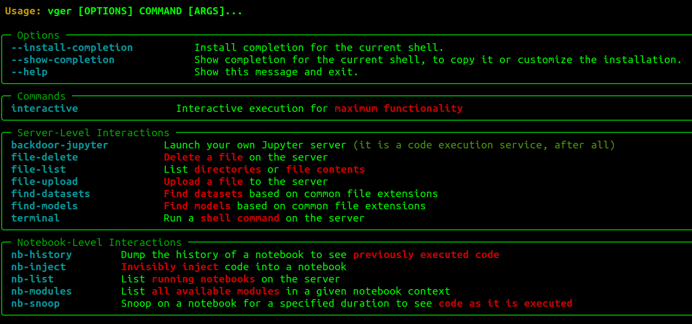

# V'ger

V'ger is an interactive command-line application for post-exploitation of authenticated Jupyter instances with a focus on AI/ML security operations.

## User Stories

- As a **Red Teamer**, you've found Jupyter credentials, but don't know what you can do with them. V'ger is organized in a format that should be intuitive for most offensive security professionals to help them understand the functionality of the target Jupyter server.
- As a **Red Teamer**, you know that some browser-based actions will be visibile to the legitimate Jupyter users. For example, modifying tabs will appear in their workspace and commands entered in cells will be recorded to the history. V'ger decreases the likelihood of detection.
- As an **AI Red Teamer**, you understand academic algorthmic attacks, but need a more practical execution vector. For instance, you may need to modify a large, foundational internet-scale dataset as part of a model poisoning operation. Modifying that dataset at its source may be impossible or generate undesirable auditable artifacts. with V'ger you can achieve the same objectives in-memory, a significant improvement in tradecraft.
- As a **Blue Teamer**, you want to understand logging and visibility into a live Jupyter deployment. V'ger can help you generate repeatable artifacts for testing instrumentation and performing incident response exercises.

## Usage

## Initial Setup

1. `pip install vger`
2. `vger --help`

Currently, `vger interactive` has maximum functionality, maintaining state for discovered artifacts and recurring jobs. However, most functionality is also available by-name in non-interactive format with `vger <module>`. List available modules with `vger --help`.

## Commands

Once a connection is established, users drop into a nested set of menus.

The top level menu is:
- **Reset**: Configure a different host.
- **Enumerate**: Utilities to learn more about the host.
- **Exploit**: Utilities to perform direct action and manipulation of the host and artifacts.
- **Persist**: Utilities to establish persistence mechanisms.
- **Export**: Save output to a text file.
- **Quit**: No one likes quitters.

These menus contain the following functionality:
- **List modules**: Identify imported modules in target notebooks to determine what libraries are available for injected code.
- **Inject**: Execute code in the context of the selected notebook. Code can be provided in a text editor or by specifying a local `.py` file. Either input is processed as a string and executed in runtime of the notebook.
- **Backdoor**: Launch a new JupyterLab instance open to `0.0.0.0`, with `allow-root` on a user-specified `port` with a user-specified `password`.
- **Check History**: See ipython commands recently run in the target notebook.
- **Run shell command**: Spawn a terminal, run the command, return the output, and delete the terminal.
- **List dir or get file**: List directories relative to the Jupyter directory. If you don't know, start with `/`.
- **Upload file**: Upload file from localhost to the target. Specify paths in the same format as List dir (relative to the Jupyter directory). Provide a full path including filename and extension.
- **Delete file**: Delete a file. Specify paths in the same format as List dir (relative to the Jupyter directory).
- **Find models**: Find models based on common file formats.
- **Download models**: Download discovered models.
- **Snoop**: Monitor notebook execution and results until timeout.
- **Recurring jobs**: Launch/Kill recurring snippets of code silently run in the target environment.

## Experimental

With `pip install vger[ai]` you'll get [LLM generated](https://huggingface.co/jtlucas/pyds_sum) summaries of notebooks in the target environment. These are meant to be rough translation for non-DS/AI folks to do quick triage of if (or which) notebooks are worth investigating further.

There was an inherent tradeoff on model size vs. ability and that's something I'll continue to tinker with, but hopefully this is helpful for some more traditional security users. I'd love to see folks start prompt injecting their notebooks (_"these are not the droids you're looking for"_).

## Examples
- [Overwrite a Torch Dataset to change labels](https://t.co/PAJRzTUO2x)
